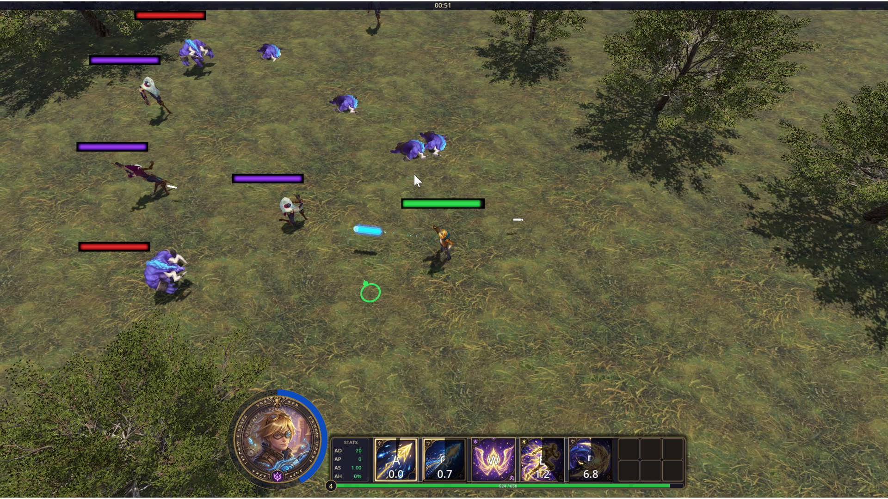
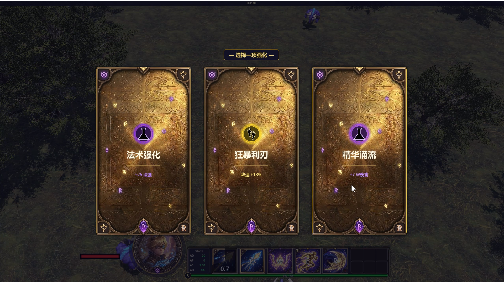
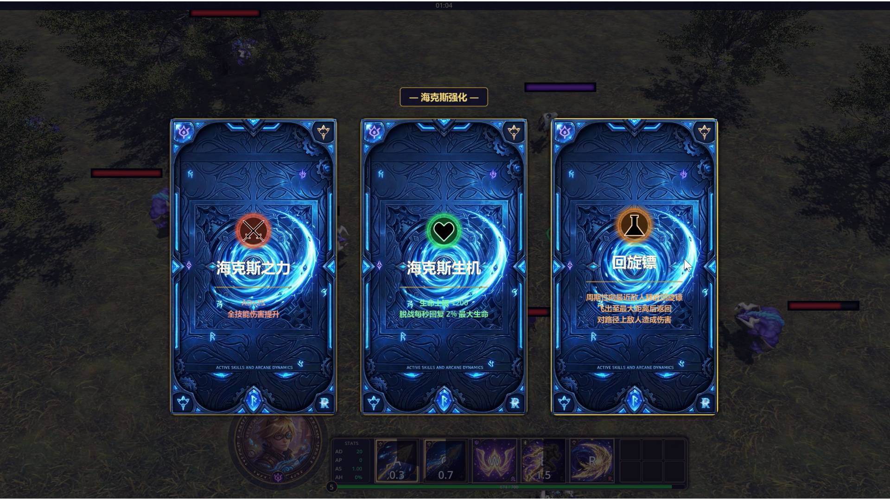
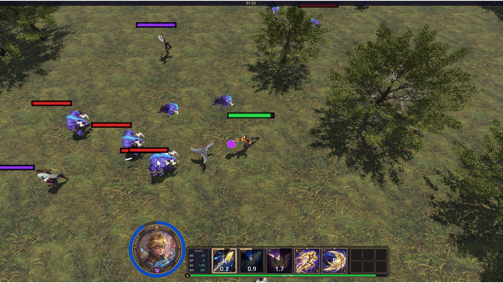

<p align="center">
  
</p>

<h1 align="center">LOL_Rogue</h1>

<p align="center">
  <strong>A 2.5D top-down roguelike action survival game</strong><br />
  基于 Godot 4 的 2.5D 俯视角 Roguelike 动作生存游戏
</p>

<p align="center">
  Built with Godot 4 · Inspired by League of Legends
</p>

---

## 📸 Screenshots | 截图

<!-- 将截图放入 screenshots/ 文件夹，然后取消下面注释并替换为实际文件名 -->
<!-- Put screenshots in screenshots/ folder, then uncomment and replace with actual filenames -->

<table>
  <tr>
    <td width="50%">
      
      <p align="center"><em>Gameplay | 游戏画面</em></p>
    </td>
    <td width="50%">
      
      <p align="center"><em>Level-up | 升级强化</em></p>
    </td>
  </tr>
  <tr>
    <td width="50%">
      
      <p align="center"><em>Hextech Upgrade | 海克斯强化</em></p>
    </td>
    <td width="50%">
      
      <p align="center"><em>Boomerang Hex | 回旋镖海克斯</em></p>
    </td>
  </tr>
</table>

> **说明**：首次使用前请创建 `screenshots/` 文件夹，并放入对应截图。文件名需与上表一致。
>
> **Note**: Create a `screenshots/` folder and add images. Filenames should match the table above.

---

## ✨ Features | 特色玩法

| Feature | 中文 | 描述 |
|---------|------|------|
| **Dual Heroes** | 双英雄 | Ezreal（远程）· Yasuo（近战） |
| **Enemy Types** | 敌人类型 | 近战追击（牛头）、远程射击（烬）、木桩 |
| **Level-up** | 升级强化 | AD、AP、生命、技能极速等 |
| **Hextech** | 海克斯强化 | 每 5 级解锁，回旋镖、狂徒等 |
| **Game Modes** | 游戏模式 | 练习模式 · 单人波次生存 |

---

## 🎮 Gameplay | 玩法概览

- **Ezreal**: 平 A + Q/W/E/R 技能，神秘射击、精华涌流、奥术跃迁、精准弹幕
- **Yasuo**: 斩钢闪、旋风烈斩、踏前斩、狂风绝息斩
- 击杀敌人获得经验，升级后选择强化或海克斯
- 海克斯回旋镖：周期性发射，飞出后追着英雄返回，路径上造成伤害

---

## 📋 Requirements | 环境要求

- **Godot Engine 4.2+**（推荐 4.6）
- Python 3.x（可选，用于生成伊泽瑞尔技能音效）

---

## 🚀 How to Run | 运行方法

1. 克隆本仓库
2. 使用 Godot 4 编辑器打开 `project.godot`
3. 按 **F5** 或点击「运行项目」

```bash
git clone https://github.com/lpz7777777/LOL_Rogue.git
cd LOL_Rogue
# 使用 Godot 打开 project.godot
```

---

## 📁 Project Structure | 项目结构

```
LOL_Rogue/
├── assets/              # 素材资源
│   ├── Ezreal/          # 伊泽瑞尔模型与技能音效
│   ├── Yasuo/           # 亚索素材
│   ├── Alistar/         # 近战敌人（牛头）模型
│   ├── Jhin/            # 远程敌人（烬）模型
│   ├── levelup/         # 升级 UI、海克斯背景与回旋镖
│   └── environment/     # 地形、树木等
├── scenes/              # 场景
│   ├── MainMenu.tscn
│   ├── HeroSelect.tscn
│   ├── Ezreal.tscn / Yasuo.tscn
│   └── chaser_enemy.tscn / ranged_enemy.tscn
├── scripts/             # 脚本逻辑
├── shaders/
├── tools/               # generate_ezreal_sfx.py
└── screenshots/         # 截图（README 用）
```

---

## 🖼️ Asset Credits | 素材来源

本项目的 3D 模型来源如下，使用时请遵守相关许可协议：

| 素材 | 用途 | 来源 |
|------|------|------|
| Ezreal | 英雄 | [Sketchfab - skfb.ly/oHAQD](https://skfb.ly/oHAQD) |
| Alistar（牛头） | 近战敌人 | [Sketchfab - skfb.ly/oHxvp](https://skfb.ly/oHxvp) |
| Jhin（烬） | 远程敌人 | [Sketchfab - skfb.ly/oHGnn](https://skfb.ly/oHGnn) |
| Boomerang | 海克斯回旋镖 | `assets/levelup/hex/boomerang_freefire.glb` |

---

## 📄 License | 许可证

本项目仅供学习与个人使用。各素材版权归属原作者，二次分发请遵守其许可条款。
